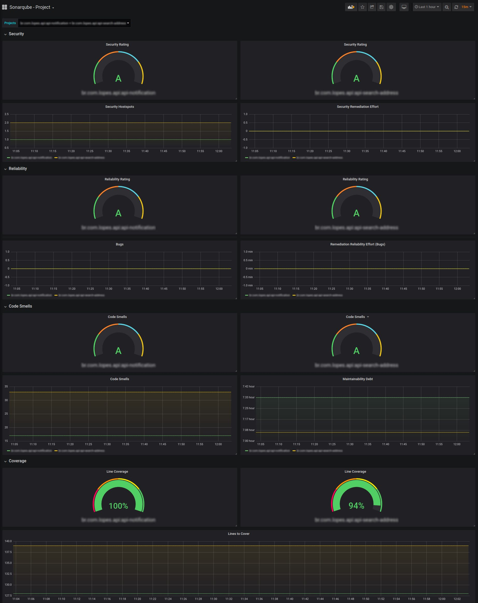

# Sonarqube Prometheus Exporter

Project to collect some Sonarqube metrics through the API and then expose such information for Prometheus collection.

With the intention of using Sonarqube for a range of projects, being able to increase or decrease the number of projects and directly their metrics, the project construction was thinking of several realities and not being directly linked to some metrics.

Importantly, Prometheus does not understand non-numeric values, so be aware if you want to add metrics that can return non-numeric values.

## How to use

First make sure there is communication and be able to authenticate to Sonarqube:
```
curl -XGET -u {USER}:{PASSWORD} https://mysonarqube.example.com
```
> Where {USER} and {PASSWORD}, replace with values that make sense in your reality.

### Externalização dos valores requeridos para autenticar na API
Export the environment variables to the values required to connect to Sonarqube. In the file **config.py**, the variables are decoded:
- SONAR_URL
- SONAR_USER
- SONAR_PASSWORD

To do this, run (Linux):
```
export SONAR_URL=https://mysonarqube.example.com
export SONAR_USER={USER}
export SONAR_PASSWORD={PASSWORD}
```
> Where {USER} and {PASSWORD}, replace with values that make sense in your reality.

### Add or remove Sonarqube metrics

In the **config.py** file, you will find a variable named **SUPPORTED_KEYS**, which loads an array of dicts containing the domain and keys that are captured by the script. If you just want to add a metric, identify your domain and then add it according to your domain. You can also add new ones as there is no restriction on the current ones.

> **Attention:** non-numeric metrics will be collected, but Prometheus will not support the values.
> https://github.com/prometheus/prometheus/issues/2227

### Metric naming

Prometheus, as a best practice, includes a value for documentation and Sonarqube natively exposes descriptions of each metric. Thus, the description of Sonarqube was addressed as documentation of Prometheus.

Each metric will have its name preserved by just adding the prefix *"sonar _"*, making it easy to identify in Prometheus.

## Grafana

Within my reality, not all metrics were used, but some that made sense at the moment include in a dashboard.

In this dashboard, projects are captured from the *sonar_bugs* metric and collecting the project key. You can view all metrics, only one or more than one.

Import the *grafana_dashboard.json* file, changing the DataSource to your reality.

### Dashboard screenshot

Simple dashboard with the possibility to filter by projects. For each selected project, a Gauge graph will be added and the others with line graphs will have one more line with that value. You can select all projects.

